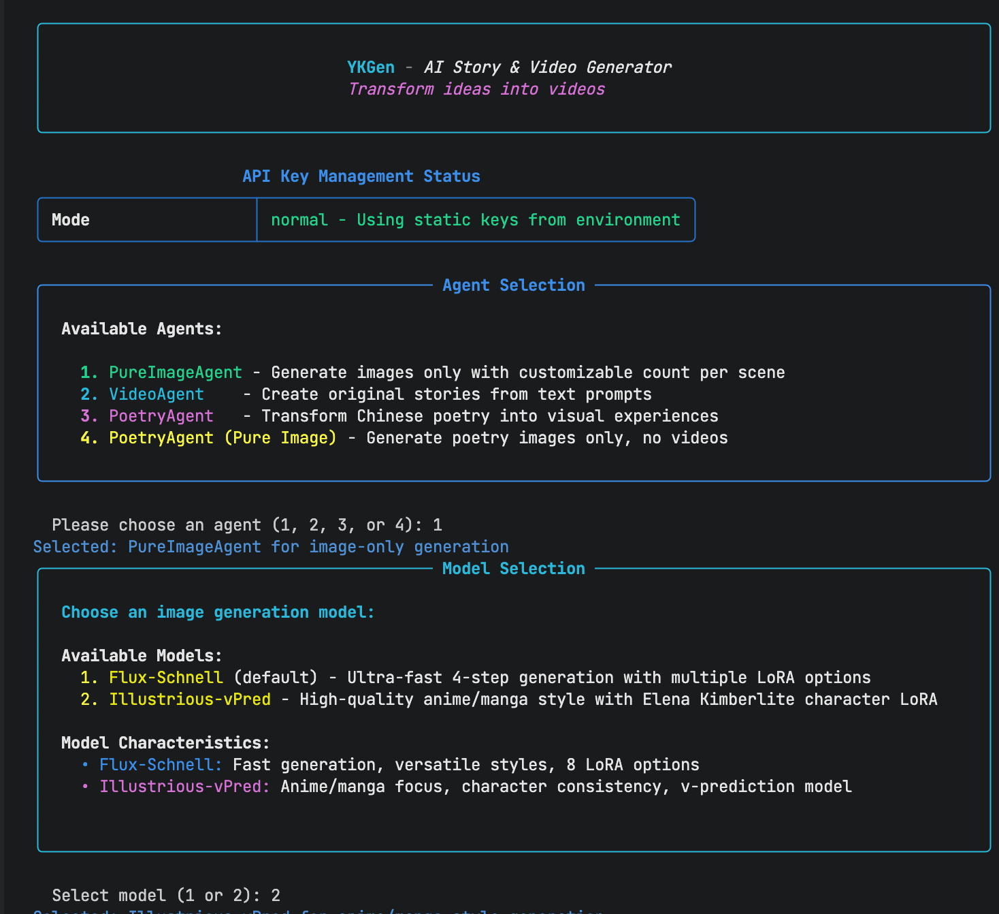
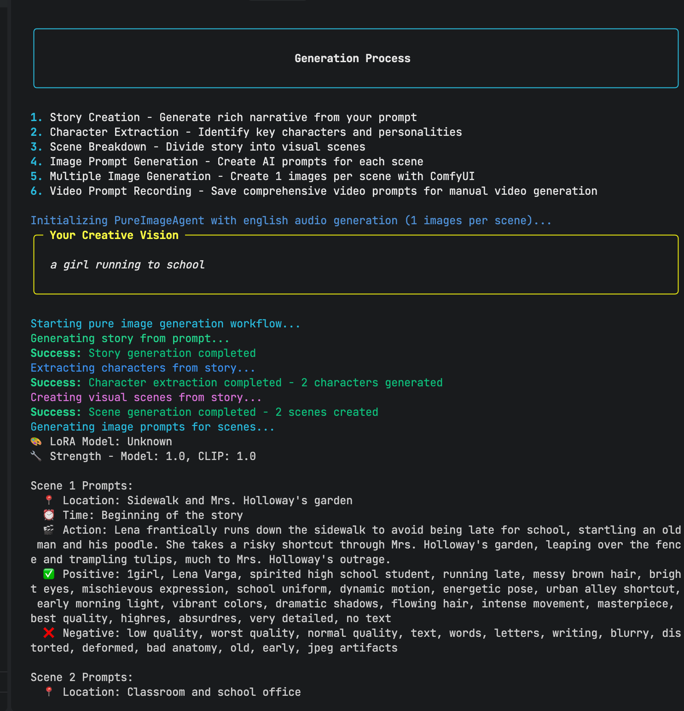
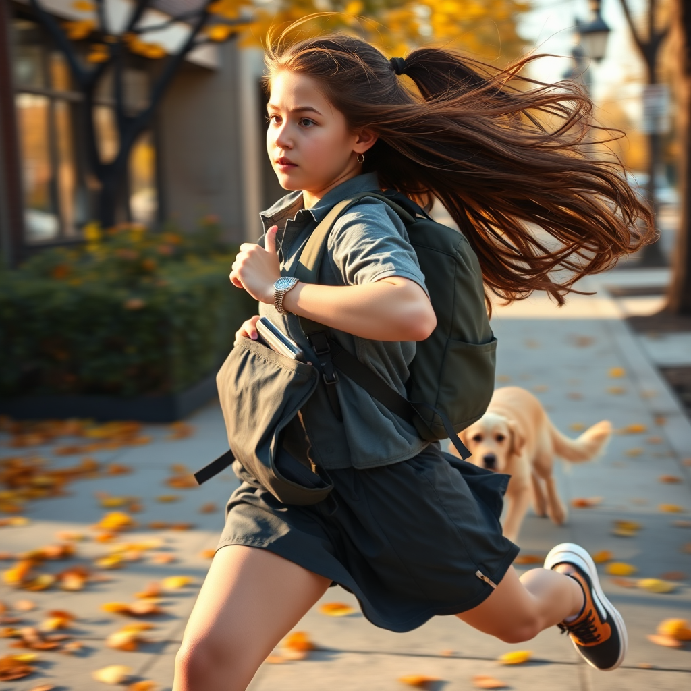

# YKGen - AI故事与视频生成器

[](https://www.python.org/downloads/)

## Language / 语言

- [English](README.md) | [中文](README_CN.md)

## 项目介绍

我尝试过很多 AI GC方案，但大多数要么过于复杂，要么整合性较弱。如果直接使用 ComfyUI 并配合复杂的工作流，实在是太麻烦了。YKGen  —— 将 ComfyUI、LLM和代码简单地结合在一起。


YKGen是一个AI生成内容工具，能够将简单的文本提示转换为完整的AI生成故事，包含图像和视频，创造一致且无缝的故事体验。
  * 文本故事生成
  * 文本角色生成
  * 文本场景生成
  * 文本歌词生成
  * 文本图像提示生成
  * 图像生成（ComfyUI）：支持自定义模型和LoRA
  * 视频生成（SiliconFlow API，但质量有限）
  * 使用ACE TTS的音频歌曲生成
  * 一致的内容（提示、相同种子、LoRA等）
  * 记录所有相关信息以便重复再生成
  * "智能"LoRA选择（分组模式，额外的LLM调用进行选择）

### 交互模式

使用YKGen最简单的方式是通过其交互式CLI：

```bash
# 启动YKGen
uv run python main.py
```

系统将引导您完成：
1. 选择代理类型（VideoAgent、PoetryAgent或PureImageAgent）
2. 如果选择视频代理，选择视频提供商（SiliconFlow）
3. 选择LoRA模型进行图像风格增强
4. 输入您的创意提示
5. 观看实时进度显示的生成过程

## ComfyUI集成

YKGen依赖ComfyUI进行高质量图像生成。ComfyUI设置需要下载大型AI模型和正确配置。

**📖 完整设置指南**：[ComfyUI设置指南](COMFYUI_SETUP_CN.md)

设置指南涵盖：
- ComfyUI安装和配置
- 必需模型下载（Flux-Schnell、Illustrious-vPred）
- LoRA模型设置以增强风格
- 性能优化
- 常见问题故障排除

**快速开始**：一旦ComfyUI在`http://127.0.0.1:8188`运行，YKGen将自动连接并使用它进行图像生成。

## 技术栈

- **语言模型**：DeepSeek-R1用于故事生成和创意任务
- **图像生成**：ComfyUI配合Flux-Schnell（超快速）或Illustrious-vPred（动漫风格）
- **视频生成**：SiliconFlow（Wan2.1 I2V）
- **音频合成**：ACE TTS用于背景音乐
- **包管理**：uv用于现代Python依赖管理
- **编排**：LangGraph用于AI工作流管理
- **视频处理**：FFmpeg用于专业视频组装

## 安装

### 先决条件

- Python 3.13+
- [uv](https://docs.astral.sh/uv/)包管理器
- 带有所需模型的ComfyUI服务器（[设置指南](COMFYUI_SETUP.md)）
- FFmpeg
- DeepSeek和视频提供商（SiliconFlow）的API密钥

## 配置

创建包含您的API密钥的`.env`文件：

```env
# 必需的API密钥
LLM_API_KEY=your_llm_api_key_here
LLM_BASE_URL=https://api.your-provider.com/v1
LLM_MODEL=your_model_name
SILICONFLOW_VIDEO_KEY=your_siliconflow_video_key_here


# 可选设置
COMFYUI_HOST=127.0.0.1
COMFYUI_PORT=8188
MAX_SCENES=3
```

## 使用方法

## 代理类型

### VideoAgent
从文本提示创建完整的视频故事：
- 生成包含角色和场景的故事
- 为每个场景创建图像
- 将图像转换为视频
- 添加背景音乐
- 合并成最终视频

### PoetryAgent
将中文诗歌转换为视觉体验：
- 将中文诗歌转换为拼音格式
- 从诗歌意象创建视觉故事
- 生成具有文化美学的图像
- 创建具有适当氛围的视频
- 添加带有拼音声乐的传统音乐

### PureImageAgent
专注于图像生成的代理：
- 生成故事和场景
- 为每个场景创建多张图像（1-10张）
- 可选音频生成
- 音频语言选择（英语或中文）
- 将视频提示保存到文本文件以供手动视频创建

## LoRA模型增强

YKGen支持用于专业艺术风格的LoRA模型：

### Flux-Schnell（默认）
- 超快4步生成（每张图像约1-2秒）
- 8种专业LoRA选项（像素艺术、动漫、水彩等）

### Illustrious-vPred
- 高质量动漫/漫画风格生成
- 用于详细动漫视觉效果的角色特定LoRA

### LoRA选择模式
- **全部模式**：将所有选定的LoRA应用于每张图像
- **分组模式**：AI智能为每个场景选择适当的LoRA

## 高级功能

### 风格定制
YKGen不应用任何默认风格，允许用户完全控制：
- 在故事提示中直接指定风格
- 当未指定时，AI从故事内容中推导适当的风格
- 使用API时以编程方式指定自定义风格

### 智能重试系统
- 对失败的视频生成自动重试
- 重试尝试之间的指数退避
- 智能检测可重试错误

### 多个视频提供商
- **SiliconFlow**：Wan2.1 I2V模型，5秒片段，720P

### 音频语言选项
- **英语**：西方音乐风格配英语歌词
- **中文**：传统中国音乐配拼音转换

## 项目架构

YKGen遵循清晰的模块化架构：

```
ykgen/
├── agents/           # AI工作流编排
├── audio/            # 音频生成
├── config/           # 配置管理
├── console/          # 用户界面
├── image/            # 图像生成
├── providers/        # 外部集成
└── video/            # 视频生成与处理
```

## 图像生成工作流程

YKGen遵循复杂的多步骤流程，确保高质量、一致的图像生成：

### 1. 故事分析与场景规划
- AI分析您的提示以创建详细的故事结构
- 将叙述分解为具有角色一致性的连贯场景
- 为每个场景生成优化的提示

#### 提示生成示例

YKGen将简单的用户提示转换为详细、优化的图像生成提示：





这些示例展示了YKGen如何通过详细的视觉描述、风格规范和技术参数来增强基本故事概念，以实现最佳的图像生成效果。

### 2. 风格与LoRA选择
- 基于内容智能选择适当的LoRA模型
- 在所有场景中保持风格一致性
- 可选的手动LoRA选择以实现创意控制

### 3. 图像生成过程
- **种子管理**：使用一致的种子确保角色/风格连续性
- **提示工程**：使用风格触发器和质量标签增强提示
- **模型选择**：在Flux-Schnell和Illustrious-vPred模型之间自动选择
- **质量控制**：内置重试机制处理失败的生成

### 4. 后处理与组装
- 图像优化和增强
- 具有平滑过渡的视频转换
- 音频同步和最终组装

## 图像一致性解决方案

YKGen采用多种技术来保持生成内容的视觉一致性：

### 当前实现
- **LoRA模型**：专业风格模型确保一致的艺术方向
- **种子一致性**：相同的种子值保持角色和风格的连贯性
- **提示工程**：精心制作的提示，具有一致的风格触发器
- **模型选择**：智能选择基础模型以获得最佳结果

### 高级一致性功能
- **角色持久性**：在场景中保持角色外观
- **风格连续性**：整个故事中一致的艺术风格
- **质量保证**：对不一致结果的自动重试

## 输出示例

每次生成都会创建一个带时间戳的目录，包含：
- 完整的生成记录
- 生成的图像
- 每个场景的视频片段
- 背景音频
- 最终合并的视频

### 生成图像示例(同一场景)

**场景 001 - 图像 01：**


*提示词：* `1girl, Maddie, high school student, energetic, chaotic morning, sprinting, dynamic motion, viewed from a low angle to emphasize speed and height, backpack bouncing mid-air, phone buzzing in her pocket, golden retriever leaping into the frame, sidewalk with morning light casting long shadows, urban setting, determined expression, flowing hair, school uniform, vibrant colors, masterpiece, best quality, newest, absurdres, highres, very detailed, motion blur on her legs, mid-action freeze`

**场景 001 - 图像 02：**


*提示词：* `1girl, Maddie, high school student, energetic, chaotic morning, sprinting, dynamic motion, close-up side view, focusing on her determined face and the phone buzzing in her pocket, backpack straps loose and flying, golden retriever in the background blurred, sidewalk with crisp autumn leaves scattering, urban setting, morning light warming the scene, flowing hair, school uniform, vibrant colors, masterpiece, best quality, newest, absurdres, highres, very detailed, shallow depth of field`

## 下一阶段路线图

我们正在不断改进YKGen，即将推出令人兴奋的新功能：

### 🎬 增强视频生成
- **Keling AI集成**：使用Keling先进AI模型的自动化视频生成
- **Google Veo 3支持**：下一代视频合成能力
- **多提供商管道**：视频生成服务之间的无缝切换

### 🎨 高级图像一致性
- **角色参考系统**：在所有场景中保持精确的角色外观
- **风格转换增强**：更复杂的风格一致性算法
- **跨场景连续性**：保持视觉连贯性的高级技术

### 🚀 性能与质量
- **优化生成管道**：在保持质量的同时更快的处理速度
- **增强模型支持**：集成最新的AI模型和技术
- **智能资源管理**：更好的GPU内存利用和批处理

*敬请期待这些令人兴奋的发展，它们将使YKGen更加强大和用户友好！*

## 开发

```bash
# 运行所有测试
uv run pytest

# 运行特定测试
uv run python tests/video_tester.py

# 格式化代码
uv run black ykgen/ tests/
uv run isort ykgen/ tests/

# 检查和验证
uv run ruff check ykgen/ tests/
uv run mypy ykgen/
```

## 链接

- [GitHub仓库](https://github.com/username/ykgen)
- [问题跟踪器](https://github.com/username/ykgen/issues)